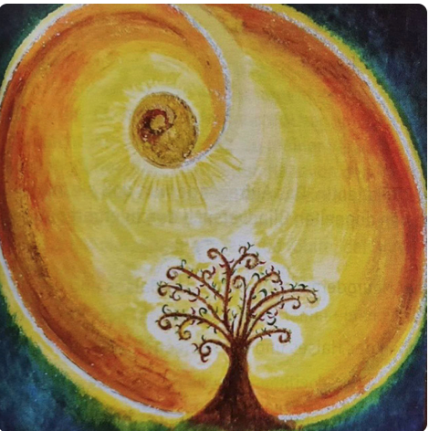

## **Kurz und knackig**
  
### **Wustes Du . . .**
  
. . . das nicht jeder Konflikt auch ein biologischer Konflikt ist?
  
. . . das nur ein biologischer Konflikt sich  
als sinnvolles biologisches Sonderprogramm  
(SBS) auf allen drei Ebenen (Psyche -Gehirn   
  - Organ) umgangssprachlich "Krankheit"   
bemerkbar macht?
  
Der biologische Konflikt hat 3 Grundvoraussetzungen, von denen nicht eine fehlen darf:  

**1. Hochakut-dramatisch**  
**2. Isolativ**  
**3. Auf dem falschen Fuß erwischt.**  

Treffen alle 3 Faktoren zusammen, handelt es  
sich um ein DHS (Dirk-Hamer-Syndrom).  
Dieser schlägt als "hamischer Herd"  
(HH=sichtbare schießscheibenförmige  
Markierung) dem zum Konfliktzeitpunkt  
empfundenen Konfliktinhalt entsprechend  
im Gehirn und gleichzeitig auf der  
Organebene ein.  

Auf der psychischer Ebene herrscht Zwangs-  
denken. Jetzt dreht sich alles nur noch  
um den empfundenen Konfliktinhalt.  

Das sinnvolle biologische Sonderprogramm  
(SBS) wurde automatisch mit dem DHS,  
am Verstand vorbei gestartet, um diesen  
Konflikt so schnell wie möglich zu lösen  
und die Notsituation zu meistern.

**Beispiel 1:**  
Du kommst in eine Straße und ein **fremdes** Haus brennt.  

oder:  

Du kommst in eine Straße und **Dein** Haus brennt.

**Ersten Teil:**  
**Hochakut-dramatisch - ja**  

**Auf dem falschen Fuß erwischt - ja**, Du  
rechnest nicht damit, ein brennendes Haus  
zu sehen, es sei denn, Du hast das Feuer  
selbst gelegt oder bereits davon gewusst!!!  

**Isolativ - nein**, da es ein fremdes Haus ist.  

**Zweiter Teil:**  

**Hochakut-dramatisch - ja**

**Auf dem falschen Fuß erwischt - ja**, siehe oben.  

**Isolativ - ja**, es ist Dein Haus, Du bist direkt  
betroffen es sei denn, Du . . .  

Bis bald zum Nächsten kurz und knackig.

Ute
