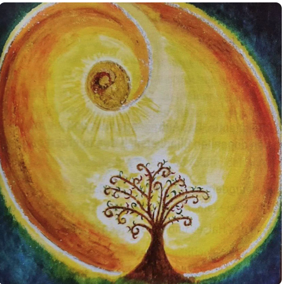

## **Kurz und knackig**
  
### **Wustes Du . . .**
  

. . . dass die **Tuberkulose eine**  
**Heilphase der Becherzellen der**  
**Bronchial-Darmschleimhaut** sind?

Der biologische Konflikt spricht  
vom **Luftbrocken**(gelbe Gruppe), den man  
nicht einspeicheln oder hineinsaugen kann.  
**Man hat Angst zu ersticken.**  

In der konfliktaktiven Phase wächst  
ein flachwachsendes Adeno-Ca bestehend   
aus Becherzellen der alten   
Bronchial-Darmschleimhaut, und eine   
verstärkte Flüssigkeitsabgabe für ein   
besseres Gleiten des Luftbrockens.  

**Ist der Konflikt gelöst, wird bei**  
**Vorhandensein von Mykobakterien die vorher**  
**entstandenen Becherzellen-Adeno-Karzinome**  
**tuberkulös-verkäsend nekrotisierend abgebaut.**

Dies bedeutet Nachtschweiß und verstärkte Müdigkeit.

Sind keine Mykobakterien vorhanden, so wird  
sich das Ganze einfach verkapseln.  

In der Mitte der Heilphase findet die  
Heilkrise mit der Zentralisation der  
peripheren Blutgefäße(kalte Hände und Füße)  
statt.

Am Ende der Heilphase ist im besten Fall  
außer kleine Vernarbungen nicht mehr viel  
zu sehen.

Bis bald zum nächsten "Kurz und knackig.

Ute

https://t.me/selbsthilfe_germanis
