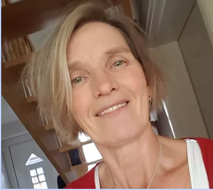

#### ***ÜBER MICH***  🍀🦋💚 

 
#### ***Was gibt es zu erzählen?***
 

#### ***Was gibt es über mich zu berichten?***

  

***Vielleicht,*** dass ich vier wunderbare Kinder habe, vier "Jungen" im Alter von 28/27/15/14.

***Vielleicht,*** dass meine Söhne meine größten Lehrmeister waren und immer noch sind.

***Vielleicht,*** dass ich mit einem wunderbaren Mann verheiratet bin.

***Vielleicht,*** dass ich in einem anderen Teil meines Lebens eine staatlich geprüfte Bilanzbuchhalterin war.

***Vielleicht,*** dass ich schon früh erkannt habe, dass es mehr zwischen Himmel und Erde gibt, als dass, was ich sehen oder anfassen kann.

***Vielleicht,*** dass ich durch eine Reiki- und Prana-Ausbildung, endlich Bestätigung bekam, was ich schon längst wusste. Es gibt feinstoffliche Energien, die ich fühlen, wahrnehmen und steuern kann.

***Vielleicht,*** dass in mir Gedanken aufsteigen, die mir wie feinstoffliche Geschenke vorkommen, welche in Worte verpackt und gelesen werden wollen.

***Vielleicht,*** dass ich Zahlen liebe und Botschaften von ihnen bekomme.

***Vielleicht,*** dass ich eine Energetiker-Ausbildung, inclusive Kybalistik, bei „Der Zweite Blick“ gemacht habe.

***Vielleicht,*** dass ich die „Kunst des Besprechen“ anwende, wenn es gerade stimmig ist.

***Vielleicht,*** dass ich es liebe, Menschen zu unterstützen und ihre Welt ein wenig heller zu machen.

***Vielleicht,*** dass ich mir vorgenommen habe, meine Welt und somit unsere Welt, ein wenig heller zu machen.

All dies könnte Dich vielleicht interessieren, aber wer weiß schon, was für den Nächsten wichtig ist.

Ich freue mich über jeden, der hierher gefunden hat und dem mein kleiner Blog hier gefällt. Es ist alles noch nicht fertig, genau genommen, habe ich gerade all meinen Mut zusammen genommen, und meinen ersten Schritt gemacht. Ich hoffe auf etwas Geduld, Unterstützung durch Anregungen, Inspiration und Wohlwollen, damit ich richtig Laufen lernen kann.

Danke

Liliklu  

Ute Klinke
