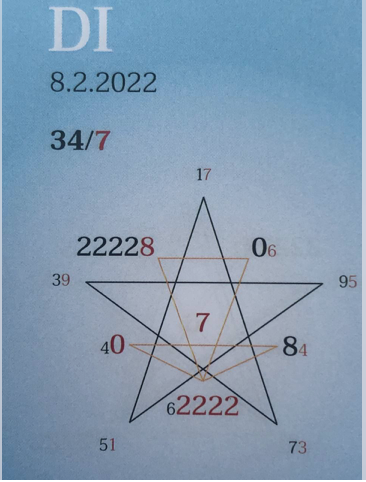

## 🍀🦋💚🍀🦋💚🍀🦋💚
## Tagespentagramm 8.2.2022
 
### Thema:
Erwachender

 
### Spannungsachsen:

  

Ihr Lieben

Der Zeitgeist des heutigen Tages aktiviert das neue Saatgut im tiefsten Grund unseres Seins.

Die Information, das Öffnen und Funkeln geschieht von innen heraus. Ein leises Knistern der Freude wie Brausepulver. Wir dürfen es in uns erspüren und erforschen. Den Prozess der Veränderung in Struktur und Ausrichtung, der sich aus dem Unterbewusstsein langsam in unsere Wahrnehmung schleicht. Der Same bricht auf.

Nimm Dir den Raum, diese Veränderung bewusst auf allen Ebenen und in allen Facetten zu erleben und bewusst zu erfahren. Nur ein kurzer Moment, allein ein Gedanke an Dein wahres Selbst, an Deine ICH BIN Gegenwart stärkt Dein Energiepotential und den in Dir stattfindenden Prozess.

Heute werd leis und verbinde Dich mit Deinem göttlichen Sein.

In Liebe zum Sein

Liliklu🦋

Danke 🌱🧚💖
