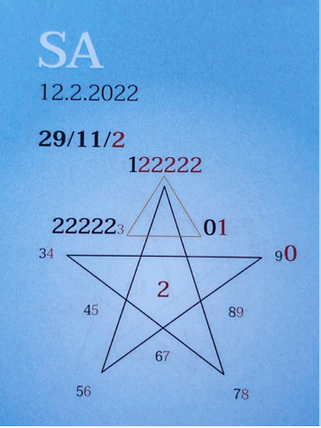

### 🍀🦋💚🍀🦋💚🍀🦋💚
## Tagespentagramm 12.2.2022

### Thema:
Ruheraum der Liebe

### Spannungsachsen:

### 🍀🦋💚

Ihr Lieben

Spürst Du es auch? In der Mitte, in unserem inneren Raum, strömt die Frequenz von Vertrauen, von Liebe und Verbundenheit. In uns mit unserer inneren Führung erfahren wir eine Kostprobe auf das, was wirklich ist – Vollkommenheit.

Einen Schritt, nur einen Millimeter aus ihm heraus, die Tür nur einen Spalt öffnen, sofort fallen Zweifel und inneres Chaos in uns ein. Lass die Tür zu!

Bleib schön in Deiner Mitte, genieße Dich in der Stille der Zeitqualität, die sich jetzt langsam, still und heimlich durch alles hindurch in alles einwebt.

Nichts ist zu tun, nur den inneren Raum, die sich durch Dich verankernde ausbreitende Frequenz des Friedens, der Liebe und Freiheit in Dir halten und verstärken.

Spürst Du es auch? Die Ausdehnung von Frieden, Freiheit und Liebe . . . ?

In Liebe zum Sein

Liliklu🦋

Danke für Dein stilles Ausdehnen . . .✨☀️♥️
