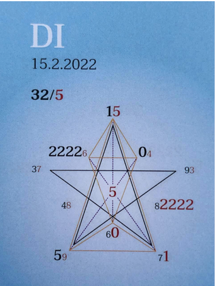

### 🍀🦋💚🍀🦋💚🍀🦋💚

## **Tagespentagramm 15.2.2022**
  
### **Thema:**
Ich geh mit mir wo hin ich will ☀️

  
### **Spannungsachsen:**
1-6 Selbstwert
2-7 Selbstbewusstseins Heilachse
5-0 Individual/Kollektiv/Wandlung
   

Ihr Lieben

Der Zeitgeist des heutigen Tages schenkt uns das Gefühl von Einheit, Verbunden sein, von angekommen sein, Individualität und Seelenliebe.

So wunderschön erfüllend, wenn wir uns unserem inneren Licht anvertrauen und den Rest Rest sein lassen. Ich geh mit mir wo hin ICH will . . .

Nichts ist getrennt, es sei denn, es wendet sich ab.

Lass Dich auf den Tanz mit Dir, mit Deiner, mit meiner mit unserer Quelle ein. Erfahre die entstehenden Synchronizitäten, das vollkommene Zusammenspiel der Schöpfung in Dir, in mir, in uns in unserer Welt.

Wir sind im Spiel der Formen die alles erfüllende Einheit, die ICH BIN.

In Liebe zum Sein

Liliklu🦋

Danke, für unseren Tanz 💕🌷🌸
