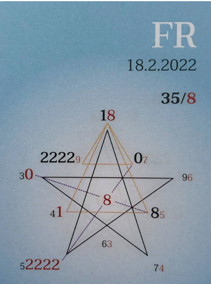

### 🍀🦋💚🍀🦋💚🍀🦋💚

## **Tagespentagramm 18.2.2022**
  
### **Thema:**
Authentizität ohne Kleber
  
## **Spannungsachsen:**
3-8 Selbstbegegnung
5-0 Individual/Kollektiv/Wandlung

  

Ihr Lieben

Der Zeitgeist des heutigen Tages möchte Dich sensibilisieren. Was immer Dir begegnet, was immer es bewirkt, sich in den verschiedensten Schichten des Seins zeigt! Sei klar und authentisch.

Fühl, jede Verurteilung, Verletzung des anderen lässt Anhaftungen entstehen. Sie werden fühlbar. Wie? Sie rauben Aufmerksamkeit, Energie und schwächen das Strahlen eines jeden. Beobachte, was in Dir passiert, wie es funktioniert.

Bring Deine Wahrheit liebevoll zum  Ausdruck, ohne Urteil, ohne anzuhaften.
Lass jeden anderen Teil der Schöpfung so sein wie es, wie er, wie sie ist. Alles darf und soll seine Wahrheit leben. Wandlung geschieht in Liebe, mit Liebe und durch Liebe.

ICH BIN klar, authentisch, liebevoll und selbstbestimmt.

In Liebe zum Sein

Liliklu🦋

Danke für Dein authentisches Sein🙏🌷💞
