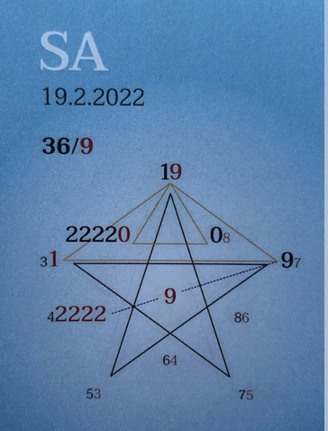

### 🍀🦋💚🍀🦋💚🍀🦋💚

## **Tagespentagramm 19.2.2022**

## **Thema:**
Wunschgestöber

## **Spannungsachsen:**  
4-9 Schicksals – Erkenntnisachse

Ihr Lieben

Die himmlischen Trigone schenken uns auf spiritueller und mentaler Ebene vollkommene Unterstützung.

Die Kraft der Unterscheidung, eigene Ideen und Geistesblitze von Fremdenbeeinflussung zu unterscheiden, ist in uns verankert. Unser Potential erwacht.

Heute wird trainiert! Es können Situationen auftauchen, in denen wir unsere Unterscheidungskraft ein wenig üben dürfen.

Wessen Wahrheit will sich gerade durch mich zeigen? Heute heißt es, sich von Wünschen anderer abkoppeln, wenn es nicht auch den eigenen Wünschen entspricht.

Mit dem eigenen Herzen klar kommunizieren und die Essenz zum Ausdruck bringen.

Herzkommunikation mit Dir, mit mir, mit uns. Wir schwingen uns aufeinander ein. Mal höher, mal tiefer, aber immer im Herzen.

In Liebe zum Sein

Liliklu🦋

Danke für Deine Klarheit🌷💞🌸
