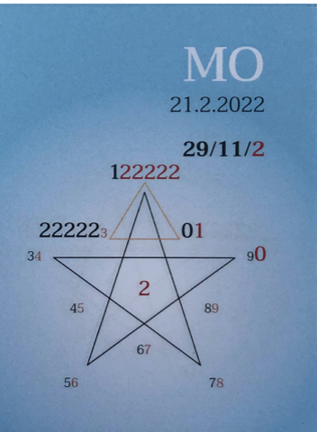

---
title:21.2.2022

hide:
- toc
---

### 🍀🦋💚🍀🦋💚🍀🦋💚

## **Tagespentagramm 21.2.2022**
  
### **Thema:**
Ausstieg vollzogen ! ! !
  

### **Spannungsachsen:**
  
### **🌷🌸🌷**

  

Ihr Lieben

Der Zeitgeist des heutigen Tages hat den nächsten Schritt, die feinstoffliche Wandlung zum "Erwachsenen ICH" in unseren Zellen vollendet. Die stille Macht der Selbstkrönung ist jetzt als Idee und Gedanke in uns verankert.

Erfühlen wir den kleinen, aber feinen Unterschied in uns? In unserem inneren Raum entfalten wir eine erweiterte Qualität von Liebe, Wahrheit und Klarheit.

Aus der Egozentrik heraus in das Verbundensein mit dem eigenen Selbst, mit unserem göttlichen Funken, der sich Schritt für Schritt in uns ausdehnt, uns nähert und informiert.

Selbstzweifel und innerer Zwiespalt verlieren ihre Macht über uns, die Neuausrichtung ist Heil-ung.

Aus Selbstzweifel und Zwiespalt wird eine harmonische Zweisamkeit mit unserem irdischen und himmlischen Sein.

In Liebe zum Sein

Liliklu🦋

Danke für Dein wahres Sein.
### 💕🌷🌸
