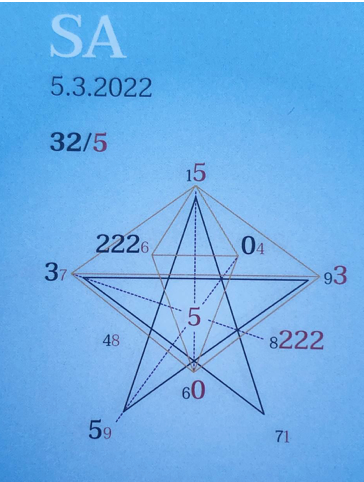

### 🍀🦋💚🍀🦋💚🍀🦋💚

## **Tagespentagramm 5.3.2022**
  
### **Thema:**
Auslese
  

### **Spannungsachsen:**
1-6 Selbstwert
3-8 Selbstbegegnung
5-0 Individual/Kollektiv/Wandlung

  

Ihr Lieben

Der Zeitgeist der 3 schüttelt und rüttelt in und um uns herum. Vorsicht ist geboten, bleib in Deiner Mitte und atme!

Alter Staub ist und wird noch eine ganze Weile aufgewühlt. Die Kunst: das Alte, Verbrauchte, Leblose und Zerrende vom Neuen Lebendigen und Nährenden zu unterscheiden.

Dann gibt es noch eine weitere Ebene, die mitmischt: Ist es mein oder ist es dein oder ist es gar Illusion? Was nun? Bleib bei Dir in Deiner Mitte, ohne Angriff, ohne zu verletzen. Schau Dir alles in Ruhe an.

Sortiere mein und dein, alt oder neu! Asche zu Asche, Staub zu Staub! Eine Herausforderung, die gemeistert werden möchte, um dann wie Phönix aus der Asche im eigenen Glanz mit neuer Schöpferkraft aufzuerstehen.

In Liebe zum Sein

Liliklu🦋

Danke für Deine Umsicht
### 💞
