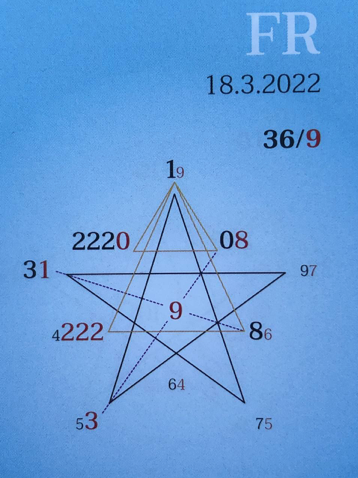

### 🍀🦋💚🍀🦋💚🍀🦋💚
## **Tagespentagramm 18.3.2022**

  

### **Thema:**
Wahrheit oder Pflicht

  

### **Spannungsachsen:**
3-8 Selbstbegegnung/Beziehungsweise  
5-0 Individual/Kollektiv/Wandlung  

  

Ihr Lieben

Der Zeitgeist des heutigen Tages fragt uns: Wahrheit oder Pflicht? Individuell und kollektiv werden wir herausgefordert und es wird uns gezeigt: Wo leben wir unsere Wahrheit, wo kommen wir falschverstandenen Pflichten nach?

Nicht einfach, aber not-wendig. Ehrlich mit sich und ehrlich mit der Welt! Scheinbare Diskrepanzen versperren uns den Weg! Sind diese Diskrepanzen überhaupt noch vorhanden? Oder ist die in jedem Einzelnen bereits statt gefundene Veränderung nur noch nicht erkannt und offen gelegt?

Schau mir in die Augen und Du wirst die Wahrheit erkennen, ein Strahlen erzählt von Wahrheit und Dunkelheit, von Pflicht.

Die Wandlung ist bereits in uns, wir dürfen sie jetzt als Wahrheit annehmen und leben.

In Liebe zum Sein

Liliklu🦋

Danke für Dein Strahlen
### ☀️💞🌟
