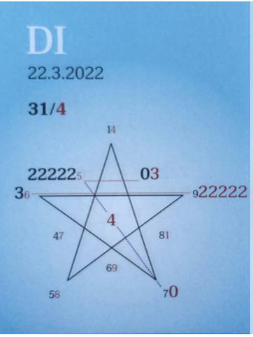

### 🍀🦋💚🍀🦋💚🍀🦋💚
## **Tagespentagramm 22.3.2022**

  

### **Thema:**
Seelenleuchten

  

### **Spannungsachsen:**
2-7 Selbstbewusstseins –
       Heilachse

  

Ihr Lieben

Es geschieht fast von ganz allein. Durch Achtsamkeit, Aufmerksamkeit im Zentrum im Herzen unseres Seins die Bewegung in uns beobachten und spüren.

Das Bewegte ist unsere jetzt aktivierte Schöpfungsintelligenz, sie beginnt wie eine kleine Signallampe zu leuchten. Viele haben sie schon gespürt, das Kribbeln und Ausdehnen, jetzt ist die Möglichkeit der Erkenntnis des Erlebens gegeben.

Seele und Geist schenken uns ihren Tanz, es entsteht eine besondere Form der Energie, die durch unsere Akzeptanz als Schöpfungsintelligenz und Schöpferkraft in und durch uns erwacht.

Alles geschieht nur durch sie. Unsere Bereitschaft, unsere Entscheidung, ihre Macht und Wirkkraft in unser Leben einzuladen und anzuerkennen, ihr zu dienen, ist der Schlüssel zur Selbstermächtigung, zum erfüllten Sein.

In Liebe zum Sein

Liliklu🦋

Danke💃🕺💚
