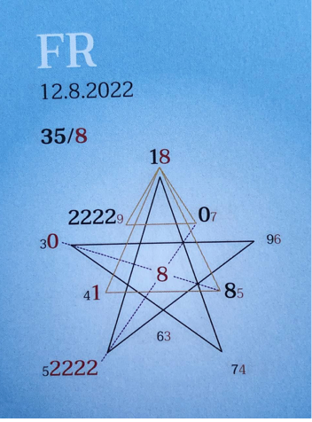

### 🍀🦋💚🍀🦋💚🍀🦋💚
## **Impuls**

  
## **Achten - Annehmen**
  

Oh man, es fällt oftmals so schwer, die eigenen Fähigkeiten und Talente zu erkennen und als DIE Besonderheit anzunehmen.

Sie sind so selbstverständlich, dass wir sie wie einen alten Schuh behandeln. Doch gerade diese Fähigkeiten und Talente gilt es als größten Schatz zu achten und anzunehmen.

Erst wenn wir sie in uns erstrahlen lassen, erkennen wir, wie einzigartig und wertvoll sie für unsere Umgebung und uns SELBST sind.

Erkenne, wer und was Du bist. Betrachte Dich mit den Augen einer liebenden Mutter. Was siehst Du?

Du siehst die Einzigartigkeit, die Du bist.

Der Schatz, nach dem wir suchen, ist in uns. Für uns unscheinbar und wertlos. Die Kunst ist, unsere Einzigartigkeit zu erkennen und annehmen.

Alles hat seinen Platz, seinen Sinn, nichts geschieht zufällig, so auch nicht Du oder ich oder das, was gerade ist.  

In Liebe zum Sein

Liliklu 🍀🦋💚
