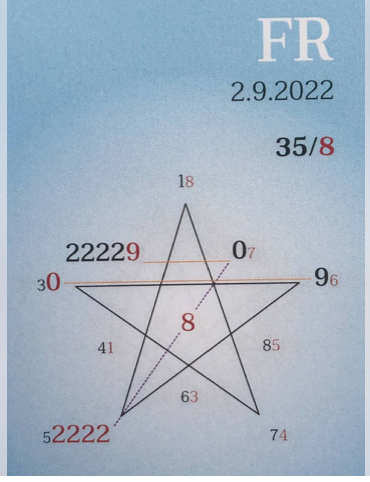

### 🍀🦋💚

## Es darf (her)vorkommen . . . Endreinigung.

Der Ausgleich geschieht immer und überall.

Egal was sich gerade zeigt, was sich bemerkbar macht, es dient dem Ausgleich der Mächte in uns.

Es kann sich Verwirrung breitmachen, uns von dem, was sich in den letzten Monaten in uns befreit hat, ablenken wollen.

Gefühle von Macht- und Sinnlosigkeit können auftauchen. Tiefe Traurigkeit und Versagensangst möchten uns ins Taumeln bringen.

Lassen wir uns ablenken? Natürlich nicht.

Klare Selbst-Ausrichtung stärkt unser ♥️Licht und bringt uns dem Ziel der Befreiung von Fremdherrschaft immer näher. Je verrückter es sich anfühlt, desto näher sind wir uns.

Lass es sich um Dich herum Wirbeln. 🌪

Wisse: Der Sturm legt sich, wenn alles, was wir nicht sind, die Macht über uns verloren hat.

In Liebe zum Sein

Liliklu🍀🦋💚
