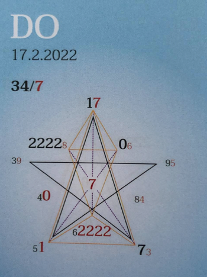

### 🍀🦋💚🍀🦋💚🍀🦋💚

## **Tagespentagramm 17.2.2022**
  
### **Thema:**
Souveränität der Sternensaat
  

### **Spannungsachsen:**
1-6 Selbstwert  
2-7 Selbstbewusstseins – Heilachse  
5-0 Individual/Kollektiv/Wandlung

   

Ihr Lieben

Der Zeitgeist des heutigen Tages möchte Dein Inneres mit den Lichtcodes der Liebe und Wahrheit erstrahlen lassen.

Erkenne Dich, Dein Seelenselbst mit all der Liebe und Wahrheit, die in ihm steckt an und bringe es zum Ausdruck.

Deine einzigartige Signatur, dass in Dir angelegte Potential, die Schöpfungsintelligenz ist aktiviert und möchte das Tor zur Manifestation durchschreiten. Öffne Dich, halte Dich und Dein Seelenselbst in all seinen Facetten für möglich.

Was bringt Dich zum Strahlen?
Wo ist die Quelle der Freude in Dir?

Schenk Dir die Liebe, das Selbstvertrauen, die Freiheit  und Souveränität, die Du in Wahrheit schon bist, warst und immer sein wirst.

ICH BIN Liebe, Selbstvertrauen, Freiheit und Souverän.

          Jetzt und für immer!

In Liebe zum Sein

Liliklu🦋

Danke ✨🧚
