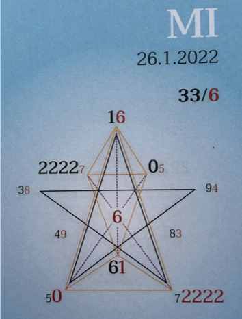

# 🍀🦋💚🍀🦋💚🍀🦋💚

# Tagespentagramm 26.1.2022

## Thema:
Harmonisierung der Ebenen

## Spannungsachsen:
1-6 Selbstwert
2-7 Selbstbewusstseins –
       Heilachse
5-0 Individual/Kollektiv/Wandlung

Ihr Lieben

Der Zeitgeist des heutigen Tages spricht von Harmonisierung der Energiekörper.

Die Neuausrichtung und Information auf feinstofflichen Ebenen sickern langsam, aber sicher in unseren grobstofflichen Körper ein.

Wir bekommen den Wandel jetzt auf körperlicher Ebene zu spüren. Es kann in den Nervenbahnen und -enden zwicken und zwacken.

Das Lichterwerden ist neu und ungewohnt, unser Körper erfährt Ablösung von alten, verkrusteten Strukturen. Je stärker der Schmerz, desto größer und grundlegender die Veränderung.

Schenken wir ihm und uns das "not-wendige" Vertrauen, Wohlwollen und die richtige Portion Nachsicht und Liebe.

ICH BIN der göttliche Wandel auf allen Ebenen meines Seins.

In Liebe zum Sein

Liliklu🦋

Danke für Dein Sein.🧚💕🌸
