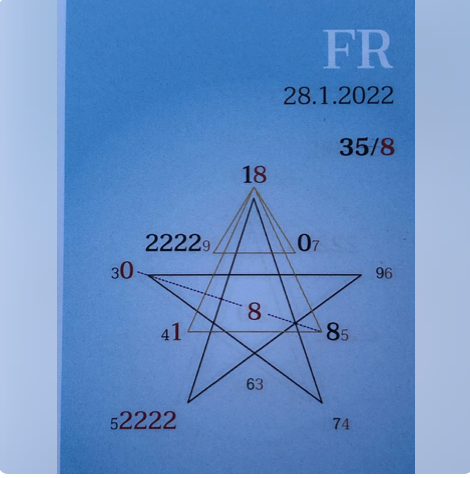

### 🍀🦋💚🍀🦋💚🍀🦋💚

# Tagespentagramm 28.1.2022
🍀
🍀
🍀
### Thema:
Tiefgang
🦋
🦋
🦋  
### Spannungsachsen:
3-8 Selbstbegegnung
💚
💚
💚
Ihr Lieben

Der Zeitgeist des heutigen Tages lädt uns
als Beobachter in die Erlebniswelt unseres
Emotionskörpers ein.

Wir bekommen den Einfluss und die Gestaltungsmacht
der Lichtformation aus höheren Ebene in unseren
Gefühlen zu spüren.

Die Beziehungsweise justiert sich neu.  
Die feineren und lichteren Frequenzen berühren  
und erwecken neue Bereiche in unserem Emotionskörper.  

Ein neues empfindsameres Miteinander wird fühlbar.  
Wir bemerken in uns ein Gefühl der Verbundenheit,  
welches sich intensiviert und uns gleichzeitig verwirrt.  

Die Kunst des Erkennens: "Welches Gefühl gehört  
zu mir und welches Gefühl gehört Dir?" Den Widerspruch des  
Verbundenseins und der klaren Abgrenzung wird fühlbar.  

ICH BIN die Individualität in der Einheit.  

In Liebe zum Sein  

Liliklu🦋  

Danke für Dein Mitgefühl und Deine Individualität.☀️💕
