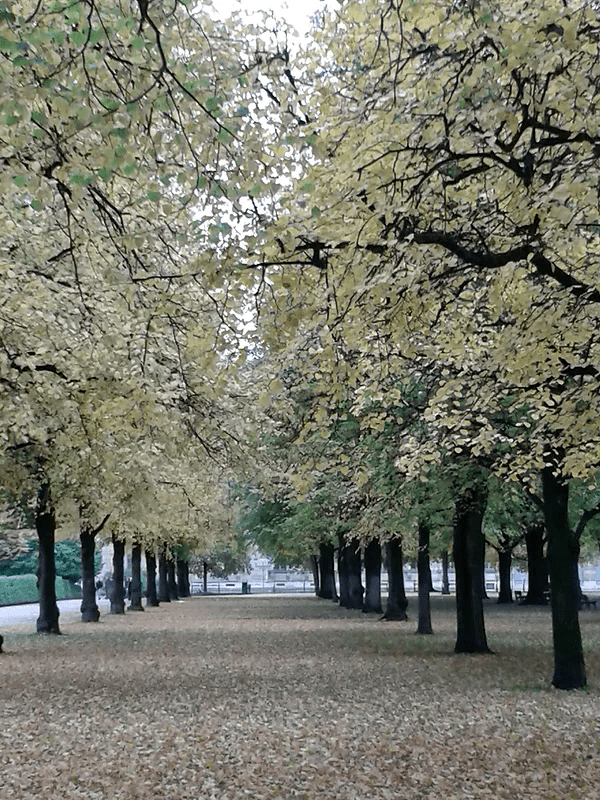

### Ulli aus Kempten
 
... Deine Website ist sehr schön und ich bekomme sehr gern Deine Tagesimpulse auf Telegram, ich bin jetzt immer schon gespannt darauf und finde sie sehr hilfreich und unterstützend. Einfach ein guter und positiver Impuls für den Tag ...

... Ich habe einen Geburtstagsbrief für einen ganz besonderen Menschen bei Ute bestellt, von dem ich weiß, dass er sich freut, etwas über sich selbst zu lesen.

Tatsächlich ist die Überraschung gelungen und es ging ihm durch und durch. Er fand es phantastisch und auch ein wenig spannend, es zu lesen. Welch wunderbarer Effekt beim Beschenkten. Man kann es immer mal wieder zur Hand nehmen und man entdeckt neue Botschaften. Ich werde wieder mal einen Brief für einen besonderen Menschen bestellen...
 
Lieben Dank Ute dafür.

 
---

### Ivana Vötter
 
Wir sind in einem unglaublichen Wandel, der uns alle ganz persönlich fordert und gleichzeitig einladet, uns in unserem tiefsten Mensch SEIN zu erkennen.

Ute schafft es mit ihrer starken Intuition und kosmischen Schau mittels einer Zahlenanalyse das Bewusstsein zu vertiefen. Menschen auf ihren spirituellen Weg zu erheben und schafft somit viel Klarheit und unterstützt uns auf unserem Weg der göttlichen Selbstbewusstwerdung. Für mich persönlich schafft jeder Austausch mit Ute neue und lebendige Perspektiven und einen tieferen Einblick in meine ganz individuelle Entwicklung. 

--- 

### Marie aus S.

Kairos !
Manchmal packe ich diesen kleinen, flinken Kerl beim Schopf - ohne zu ahnen was daraus entsteht!

Liebe Ute, genauso kamst du in mein Leben.

Ich verkaufte gebrauchte Bücher auf einer Online Plattform und du erstandest mein Allererstes. So kamen wir ins Gespräch, zunächst per Email, später über eine App.
Wir näherten uns an, öffneten uns und wurden reichlich beschenkt.
Der Begriff Energetikerin sagte mir nichts. Ich bin in der Homöopathie Zuhause, habe einige Erfahrung mit dem wissenden Feld, mit Meditation, mit Ki-Arbeit, und wurde durch meine Lebensgeschichte zu einer Frau mit feinen Antennen.
Doch wäre ich nie bewusst auf die Suche nach einem Menschen mit energetischen Fähigkeiten und Begabung gegangen, um heiler zu werden.
So genau weiß ich nicht, was da passiert, wenn wir telefonieren. Ich erzähle, du fragst nach, sagst etwas dazu. Du arbeitest manchmal währenddessen, oft hinterher in „meinen Feldern“.
Ich spüre jedesmal wenn „es“ passiert und bin verblüfft, dass der Zeitpunkt der Besserung mit dem deiner Arbeit immer übereinstimmt. Unendlich dankbar bin ich darüber, dass du immer vorab sagst, was du tun möchtest und meine Zustimmung einholst.
In meiner Vorstellung stellst du dich während des Telefonats auf mich ein, so wie es die Teile eines Walkie-Talkie tun. Senden und Empfangen benötigt eine gleiche Frequenz.
 
Du erklärst mir nach deiner Arbeit, was du gemacht hast. Felder gereinigt, Schutz verstärkt, Felder aufgefüllt usw. Manchmal bemerkst du erst während der Arbeit Dinge, die du vorher noch nicht gesehen hast.
So fühle ich mich nicht einfach „be“handelt und unwissend gelassen. Sondern ich kann selbst noch einmal hin fühlen und versuchen, ein Gespür für meine Angelegenheiten zu entwickeln.
Du hast mir schon einige praktische Vorgehensweisen ans Herz gelegt und diese verbinde ich mit anderen Übungen. Morgens beim ersten Gang mit meinem Hund nehme ich mir dafür Zeit. Sie sind mir zum Ritual geworden.
Ich habe Zugang zu den Lenormand Karten bekommen und es bereitet mir mittlerweile viel Vergnügen, damit umzugehen. Das ist ein Weg für mich, mich mit meinem höherem Selbst auszutauschen.
Des öfteren warst du schon mein „Notfall“- Kontakt - und danach konnte ich meinen Weg weiter gehen. Vielen lieben Dank!!!!!!!!!
Vor einer Woche schrieb ich dir - noch ganz gefangen in einem entsetzlichen Erlebnis. Du konntest mir dessen Sinn auf einer anderen Ebene zeigen. Mein Entsetzen verwandelte sich in Dankbarkeit und Demut. Das führte mich dazu, eine Entscheidung zu treffen und ins Tun zu kommen. Und ich kann mich darüber richtig freuen!
Das alles habe ich jetzt aufgeschrieben, weil einfach nicht Jeder gebrauchte Bücher online verkauft : )

und ich Menschen Mut machen möchte andere Wege zu gehen

und ich dir sagen möchte, was für ein wundervoller Mensch du bist.

Alles Liebe in Liebe Marie